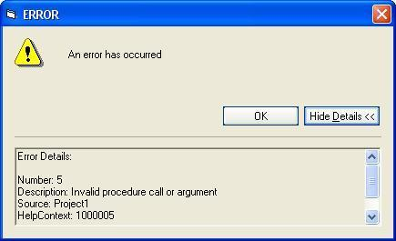



## \_xp Style Error Box\_

### Description

See screenshot, my program also comes with an error creating procedure (an example on how to use the error box). Comes in handy - buttons are xp style.
 
### More Info
 

             |
---                |---
**Submitted On**   |2002-08-02 23:34:10
**By**             |[BelgiumBoy\_007](https://github.com/Planet-Source-Code/PSCIndex/blob/master/ByAuthor/belgiumboy-007.md)
**Level**          |Beginner
**User Rating**    |4.5 (18 globes from 4 users)
**Compatibility**  |VB 6\.0
**Category**       |[Debugging and Error Handling](https://github.com/Planet-Source-Code/PSCIndex/blob/master/ByCategory/debugging-and-error-handling__1-26.md)
**World**          |[Visual Basic](https://github.com/Planet-Source-Code/PSCIndex/blob/master/ByWorld/visual-basic.md)
**Archive File**   |[\_xp\_Style\_1396901022002\.zip](https://github.com/Planet-Source-Code/belgiumboy-007-xp-style-error-box__1-39454/archive/master.zip)

